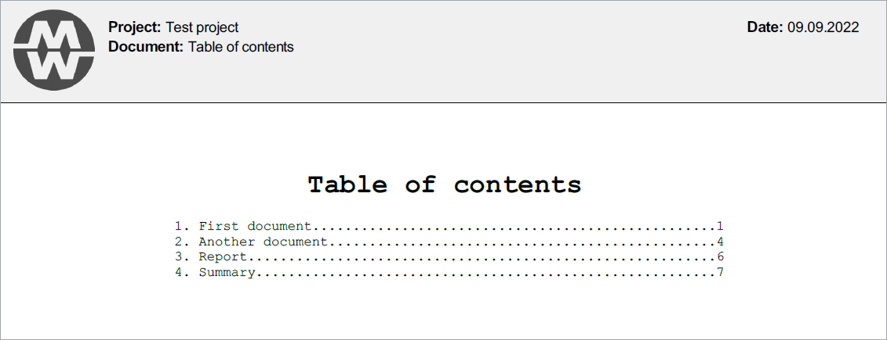

# ReportBuilder

This application allows to create final technical report composed from many partial reports which comes in PDF format from various third-party software.

Some of essential features are:
- Adding additional custom overlay layer to source PDF files in order to hide or change unwanted parts of source document (for example add company header and footer).
- Creating table of contents based on included documents.
- Full customisation of every page of the output report.
- Full control over pages numbering.
- Creating additional custom html templates for overlay layer and table of contents (using jinja template engine).
- Merging automatically PDF files within the project.
- Allowing to create and maintain following revisions of project.
- Slicing source PDF files for extracting only required parts.
- Support for any PDF page size.

### Picture 1. Overwriting source PDF header from templates:

---

### Picture 2. Automatic and fully customisable table of contents:

